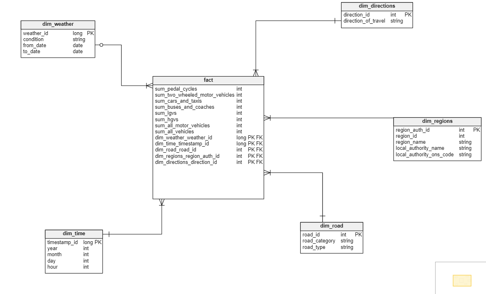

<h1 align="center">
    UK traffic analysis
</h1>

## About
The main goal of the project was to create data warehouse in the star architecture based on the data from source: https://www.cs.put.poznan.pl/kjankiewicz/bigdata/projekt2/uk-trafic.zip. The data come from the Department of Transport of United Kingdom. The main tasks of the project are listed below:

- project a data warehouse in star architecture containing fact table with 1-5 measures and 3-5 dimension tables with mandatory time dimension
- project 2-3 analyses based on projected data warehouse. Each analysis contains 3 dimensions and one measure.
- implement mentioned data warehouse using Delta Lake tables
- implement ETL processes using Spark programs written in Scala and compile to <i>.jar</i> executable files registered to repeatable and automatic use which will load the data warehouse directly from source data
- orchestrate the data workflow using tools such as e.g. Apache Airflow
- implement invented analyses (their description are available in this repo inside <i>analysis_description.txt</i> file) in a notebook (formatted graphs)

The data was loaded using best practices such as e.g. RDD - for non-structed data sources, DataFrames for structured. All the implemented programs are also available in the <i>scala_programs</i> folder.

## Getting started and usage
Firstly, you have to upload source data from <i>.zip</i> to <i>uk-traffic</i> folder in your private bucket. To run the project you need to setup a cluster (an example run-cluster-command for Google Cloud Platform is available in the proper file). Then you need to upload jars from <i>jars</i> folder and project2.py file to schedule data workflow in Apache Airflow. Next you have to run a set of commands in SSH CLI to run Airflow correctly:
```
export AIRFLOW_HOME=~/airflow
pip install apache-airflow
export PATH=$PATH:~/.local/bin
airflow db init
airflow standalone
```
Now you need to save credentials for Airflow service which will be: 

- username: admin
- password: <i>Copy the one which will be shown on your screen in SSH CLI</i>

Then stop Airflow service, create <i>dags</i> folder inside <i>airflow</i>, move jars and project2.py file to proper destinations and run Airflow once again:

```
mkdir -p ~/airflow/dags/project_files
mv project2.py ~/airflow/dags/
mv *.jar ~/airflow/dags/project_files
airflow webserver --port 8081 -D
airflow scheduler
```

Stay this console open, finally you have to configure tunnel for localhost:8081 between GCP and your local machine. The process can be done easily e.g. in PuTTY client. Then you can login to Airflow service using stored credentials previously, find your project workflow and configure runing it by delivering your Google account <i>user_name</i> and private <i>bucket_name</i>. The data warehouse should be build approximately in 10 minutes (<i>duration_of_building_warehouse_pipeline</i> file). To run analyses for the warehouse, you need to attach <i>Final_analysis_results.zpln</i> file to Zeppelin client in GCP. Unfortunately, you need to configure spark interpreter to store Delta Lake tables at first. You can also try to run the commands from the notebook inside Databricks and try to deeply understand the results of that analyses ;)

## Warehouse schema
